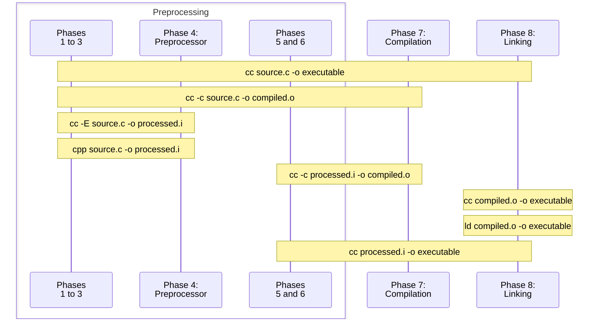

# C Compilation

The compilation of a C program is made out of several steps, called _translation phases_.
Preprocessing is one of such phases, and to better understand what can and cannot be done with the preprocessor,
we'll have to learn a bit about what each phase does, and how they are integrated together.

## Phases of translation

The C Standard defines 8 phases of translation, where the output of a phase is the input of the next :
1. Interpret the encoding of the source files (_e.g._ replace `\r\n` with `\n`)
1. Delete newlines preceded by `\`
3. {#phase3}
   **Tokenizing**: group characters that belong together, assiging a "type" to each group. ([More on that later](#tokenizing))
4. {#phase4}
   **Preprocessing**:
   1. The preprocessor is executed
   1. Each file introduced with the `#include`{l=C} directive goes through phases 1 through 4, recursively.
   1. At the end of this phase, all preprocessor directives are removed from the source.
1. Escape sequences in string literals are interpreted (_e.g._ the two adjacent characters `\` `n` are replaced by a single byte with the value 10)
6. {#phase6}
   Adjacent string literals are concatenated
7. {#phase7}
   **Compilation**: the tokens are syntactically and semantically analyzed and translated as a translation unit.
1. **Linking**: Translation units and library components needed to satisfy external references are collected into a program image which contains information needed for execution in its execution environment (the OS).

_Source_ : {bdg-link-primary-line}`cppreference <https://en.cppreference.com/w/c/language/translation_phases>`

:::{dropdown} Terminology
:icon: info
:color: primary

The word "preprocessing" can be used more generally to refer to all the steps before compilation (phases 1 to 6).

In the GNU toolchain, the `cpp` ("The C Preprocessor") program handles phases 1 to 4.
:::

:::{dropdown} It is possible to ask the compiler to only do specific phases
:open:
:icon: light-bulb
:color: success


:::

## Tokenizing

To best undestand what kind of input [phase 4](phase4) is working with, we must detail what [phase 3](phase3) does.
(However, _how_ it does it is outside the scope of this book[^fsm])

[^fsm]: If you are interested, learn about finite state machines with this excellent lecture : [Theory of computation](https://youtube.com/playlist?list=PLbtzT1TYeoMjNOGEiaRmm_vMIwUAidnQz&si=iNoQkSVbbMKVzr_P)

A tokenizer can be viewed as a black box that
 - takes as input a sequence of characters
 - outputs a series of _tokens_, where a token is a group of characters with an assigned type.

This particular tokenizer recognizes and can emit the following types of tokens:

| Type                        | Description                                             | Examples                                                                        |
|:----------------------------|:--------------------------------------------------------|:--------------------------------------------------------------------------------|
| inclusion                   | the name of a file the content of which shall be pasted | {bdg-secondary-line}`<math.h>` {bdg-secondary-line}`"libft.h"`                  |
| identifier                  | a keyword or name (type, variable, function, ...)       | {bdg-primary-line}`size_t` {bdg-primary-line}`strlen` {bdg-primary-line}`while` |
| preprocessing number        | integer and floating constants                          | {bdg-danger-line}`42` {bdg-danger-line}`1.61` {bdg-danger-line}`3.E-12`         |
| operator or ponctuator      |                                                         | {bdg-dark-line}`+` {bdg-dark-line}`{` {bdg-dark-line}`<<=`                      |
| string or character literal |                                                         | {bdg-success-line}`Nice name` {bdg-success-line}`A`                             |
| space                       |                                                         | {material-regular}`space_bar`                                                   |
| newline                     |                                                         | {material-regular}`keyboard_return`                                             |

```{note}
When a comment is encountered, a single space ({material-regular}`space_bar`) is emitted.

If adjacent newlines are encountered, a single one may be emitted.
```

It's easier to understand with an example:

::::{card}
Source file
^^^
:::{preprocessed} 01_hello
:no-preprocessed:
:no-output:
:::
::::

:::{card}
Phase 3 input
^^^
`#` `i` `n` `c` `l` `u` `d` `e` ` ` `<` `s` `t` `d` `i` `o` `.` `h` `>` `\n` `\n` `/` `*` ` ` `W`...
+++
A stream of characters
:::

:::{card}
Phase 3 Output
^^^
{bdg-secondary-line}`<stdio.h>` {material-regular}`keyboard_return`
{material-regular}`space_bar` {material-regular}`keyboard_return`
{bdg-primary-line}`int` {material-regular}`space_bar` {bdg-primary-line}`main` {bdg-dark-line}`(` {bdg-dark-line}`)` {material-regular}`keyboard_return`
{bdg-dark-line}`{` {material-regular}`keyboard_return`
{material-regular}`space_bar` {bdg-primary-line}`printf` {bdg-dark-line}`(`
{bdg-success-line}`Hello world\n` {bdg-dark-line}`)` {bdg-dark-line}`;` {material-regular}`keyboard_return`
{bdg-dark-line}`}` {material-regular}`keyboard_return`
+++
A stream of tokens
:::

```{important}
The characters `"` and `'` are never emmited as tokens, their presence in the source code affects the type of the token that will be emitted:
| Input                   | Output                                                                                                                                        |
|:------------------------|:----------------------------------------------------------------------------------------------------------------------------------------------|
| `print(my_name)`{l=C}   | {bdg-primary-line}`print` {bdg-dark-line}`(` {bdg-primary-line}`my_name` {bdg-dark-line}`)`                                                   |
| `print("my_name")`{l=C} | {bdg-primary-line}`print` {bdg-dark-line}`(` {bdg-success-line}`my_name` {bdg-dark-line}`)`                                                   |
| `x = a;`{l=C}           | {bdg-primary-line}`x` {material-regular}`space_bar` {bdg-dark-line}`=` {material-regular}`space_bar` {bdg-primary-line}`a` {bdg-dark-line}`;` |
| `x = 'a';`{l=C}         | {bdg-primary-line}`x` {material-regular}`space_bar` {bdg-dark-line}`=` {material-regular}`space_bar` {bdg-success-line}`a` {bdg-dark-line}`;` |
```
