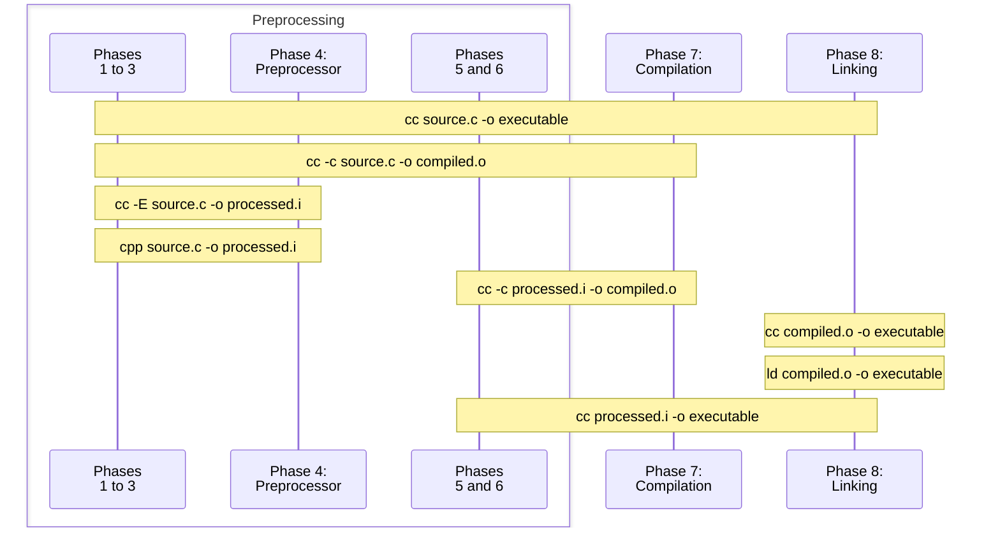

# Quick refresher

## Prepro... something ?

If you are reading this book, it means you already know what the C preprocessor is, right ? ...right ? Did you even write C before ?

Yes ? Then let's start from there. The preprocessor is what you interact with when you start a line with `#`.
It is used most notably to `#incude`{l=C} an other file, _i.e._ to paste the verbatim content of that file, in place of the include directive.

Let's say that again, what the preprocessor does, is to replace an expression, like `#include <toto.h>`{l=C} with characters, here the content of `toto.h`.

```{note}
No assumption is made about the content of the included file, it technically doesn't have to be valid C, or even code at all...
```

And that's all it does: it replaces expressions with text, be it when it replaces
 - `NULL`{l=C} with `((void*)0)`,
 - `#if 0`{l=C}, `#endif`{l=C} and the 1978 lines in between with... nothing, effectively deleting them
 - `#if 1`{l=C}, `#endif`{l=C} and the 326 lines in between with... those 326 lines, being as useful as a cow watching a train pass

Mmh yes it also has a `#define`{l=C} directive... for the user to define more expressions to be replaced with text!
It's called macros by the way, and might prove useful in the future.

{attribution="GCC Documentation"}
> A **macro** is a fragment of code which has been given a name. Whenever the name is used, it is replaced by the contents of the macro.

That's it, you now understand most of what there is to understand about the C preprocessor...

...but the devil is in the details, so before jumping into the next chapter, we'll review our knowledge of C compilation.

## C Compilation

The compilation of a C program is made out of several steps, called _translation phases_.
Preprocessing is one of such phases, and to better understand what can and cannot be done with the preprocessor,
we'll have to learn a bit about what each phase does, and how they are integrated together.

### Phases of translation

The C Standard defines 8 phases of translation, where the output of a phase is the input of the next :
1. Interpret the encoding of the source files (_e.g._ replace `\r\n` with `\n`)
1. Delete newlines preceded by `\`
3. {#phase3}
   **Tokensizing**: group characters that belong together, assiging a "type" to each group. ([More on that later](#tokenizing))
4. {#phase4}
   **Prepocessing**:
   1. The preprocessor is executed
   1. Each file introduced with the `#include`{l=C} directive goes through phases 1 through 4, recursively.
   1. At the end of this phase, all preprocessor directives are removed from the source.
1. Escape sequences in string literals are interpreted (_e.g._ the two adjacent characters `\` `n` are replaced by a single byte with the value 10)
6. {#phase6}
   Adjacent string literals are concatenated
7. {#phase7}
   **Compilation**: the tokens are syntactically and semantically analyzed and translated as a translation unit.
1. **Linking**: Translation units and library components needed to satisfy external references are collected into a program image which contains information needed for execution in its execution environment (the OS).

_Source_ : {bdg-link-primary-line}`cppreference <https://en.cppreference.com/w/c/language/translation_phases>`

```{note}
The word "preprocessing" can be used more generally to refer to all the steps before compilation (phases 1 to 6).

In the GNU toolchain, the `cpp` ("The C Preprocessor") program handles phases 1 to 4.
```

:::{tip}
It is possible to ask the compiler to only do specific phases :


:::

### Tokenizing

To best undestand what kind of input [phase 4](phase4) is working with, we must detail what [phase 3](phase3) does.
(However, _how_ it does it is outside the scope of this book)

A tokenizer can be viewed as a black box that
 - takes as input a sequence of character
 - outputs a series of _tokens_, where a token is a group of characters with an assigned type.

This particular tokenizer recognizes and can emit the following types of tokens:

| Type | Description | Examples
| :--- | :---------- | :------
| inclusion  | the name of a file the content of which shall be pasted | {bdg-secondary-line}`<math.h>` {bdg-secondary-line}`"libft.h"`
| identifier | a keyword or name (type, variable, function, ...) | {bdg-primary-line}`size_t` {bdg-primary-line}`strlen` {bdg-primary-line}`while`
| preprocessing number | integer and floating constants | {bdg-danger-line}`42` {bdg-danger-line}`1.61` {bdg-danger-line}`3.E-12`
| operator or ponctuator |  | {bdg-dark-line}`+` {bdg-dark-line}`{` {bdg-dark-line}`<<=`
| string or character literal |  | {bdg-success-line}`Nice name` {bdg-success-line}`A`
| remaining non-whitespace |  |
| space | | {material-regular}`space_bar`
| newline | | {material-regular}`keyboard_return`

```{note}
When a comment is encountered, a single space ({material-regular}`space_bar`) is emitted.

If adjacent newlines are encountered, a single one may be emitted.
```

It's easier to understand with an example:

::::{tab-set}

:::{tab-item} Compiler view

```{literalinclude} ../samples/01_hello.c
:caption: Source file
:lineno-start: 1
:language: C
```
:::

:::{tab-item} Preprocessor view

```{literalinclude} ../samples/01_hello.c
:caption: Source file
:lineno-start: 1
:language: prepro
```
:::

::::

:::{card}
Phase 3 input
^^^
`#` `i` `n` `c` `l` `u` `d` `e` ` ` `<` `s` `t` `d` `i` `o` `.` `h` `>` `\n` `\n` `/` `*` ` ` `W`...
+++
A stream of characters
:::

:::{card}
Phase 3 Output
^^^
{bdg-secondary-line}`<stdio.h>` {material-regular}`keyboard_return`
{material-regular}`space_bar` {material-regular}`keyboard_return`
{bdg-primary-line}`int` {material-regular}`space_bar` {bdg-primary-line}`main` {bdg-dark-line}`(` {bdg-dark-line}`)` {material-regular}`keyboard_return`
{bdg-dark-line}`{` {material-regular}`keyboard_return`
{material-regular}`space_bar` {bdg-primary-line}`printf` {bdg-dark-line}`(`
{bdg-success-line}`Hello world\n` {bdg-dark-line}`)` {bdg-dark-line}`;` {material-regular}`keyboard_return`
{bdg-dark-line}`}` {material-regular}`keyboard_return`
+++
A stream of tokens
:::

```{important}
The characters `"` and `'` are never emmited as tokens, their presence in the source code affects the type of the token that will be emitted:

| Input | Output
| :---- | :-----
| `print(my_name)`{l=C} | {bdg-primary-line}`print` {bdg-dark-line}`(` {bdg-primary-line}`my_name` {bdg-dark-line}`)`
| `print("my_name")`{l=C} | {bdg-primary-line}`print` {bdg-dark-line}`(` {bdg-success-line}`my_name` {bdg-dark-line}`)`
| `x = a;`{l=C} | {bdg-primary-line}`x` {material-regular}`space_bar` {bdg-dark-line}`=` {material-regular}`space_bar` {bdg-primary-line}`a` {bdg-dark-line}`;`
| `x = 'a';`{l=C} | {bdg-primary-line}`x` {material-regular}`space_bar` {bdg-dark-line}`=` {material-regular}`space_bar` {bdg-success-line}`a` {bdg-dark-line}`;`
```

### Preprocessor

Let's recap what we have learned so far about the C preprocessor:
 - It is a preliminary compilation step, happening before the compilation proper ([phase 7](phase7))
 - Its input is a stream of tokens

What that  means, is that the preprocessor manipulates text, not values:
 - It cannot use the result of expressions like `1 + 3`{l=C}, `sizeof(int)`{l=C}, or `strlen("Hello")`{l=C}[^strlen] that are evaluated during [phase 7](phase7).
 - What it _can_ do is more akin to string manipulation that math: it is meant to modify / generate code, not to do computation

[^strlen]: While in theory not different from other functions, `strlen` _may_ be computed at compile-time in practice, as an inlined compiler built-in, when its input is a string literal.

#### Directives

As mentioned in the intro, interacting with the preprocessor is done by starting a line with the `#` character, followed by a preprocessing directive:

`#include <filename>`{l=C}
:
	1. Look for a file called _filename_ in folders provided to the preprocessor[^include] with the `-I` flag

[^include]: Here we are refering to the preprocessor program, often called `cpp`, that handles phases 1 to 4. More often than not it is called by the compiler, with the relevant flags being forwared as-is.
